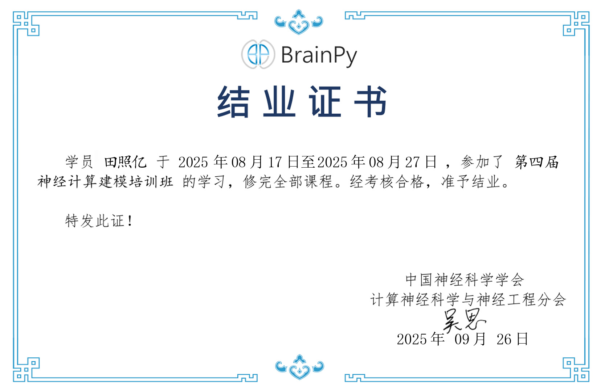

import { LinkPreview } from 'astro-pure/advanced'

## 前言及课程测评

本身对计算神经科学比较感兴趣加上假期没什么事，于是就报了吴思老师组的[第四期神经计算建模及编程培训班](https://meeting2025.cns.org.cn/4thNCMP/?sessionid=训)，学生中博士生居多，但课程本身就是面向零基础的，所以大一报也没问题，具体内容可参考[课表](#课表)。

博客中所有图片均出自课程PPT，感谢老师们两周的教导!
<LinkPreview href='https://meeting2025.cns.org.cn/4thNCMP/?sessionid=训' />

### 线上

知识比较硬核，是由吴思老师组的博士生或者曾经的博士生讲授，最好先学过高数下的ODE部分，大致可见后面的笔记，每次课都有对应的作业和回放，作业比较轻松，每次作业都有对应的答案。

对于我来说，比起编程，可能更重要的是对各种模型的讲解，感觉适合作为神经计算建模的入门，此外所有回放与课程资料都是永久的，可以当作字典，等需要时再回来查。

### 线下（第一届类脑计算特训营）

三天的体验非常不错，也了解到了很多东西，活动安排可见[课表](#课表)

第一天没有安排，我是12点到的北京，然后吃个饭后就可以出去玩（“珠海半日游”），横琴岛上没什么好玩的，甚至人都没多少，建议直接打车去香洲区那边，在靠海的堤岸上骑共享单车的感觉是非常不错的。此外或许可以提前办个港澳通行证，可以直接去澳门玩。

第二，三天上午都是和类脑计算相关的讲座，中间有茶歇；第二天下午是天琴芯实战，就是用BPU跑Brainpy的代码和复现各种发放类型，还是比较方便；第三天下午是参观广东省智能科学与技术研究院3层展厅和参观横琴规划展览馆，返程途中乘车环游横琴岛，并有专人讲解。此外与智能院老师交流环节形式也非常多样，有博士生报告，有和老师交流，有进实验室参观，同行的人比较多，所以不担心有什么压力，只不过如果所有人都不说话的话可能会有些尴尬。

**报销规定如下：**

> 根据活动报销规定，本次活动营员凭票报销国内出发地至珠海的双程交通费用（到达珠海时间为8月28日，离开珠海时间为8月31日），报销总额不超过**1300元**，超过部分自付，其中飞机仅报销**普通经济舱、高铁仅报销二等座**。市内交通费不予报销。

报销上限1300，可能并不足以覆盖掉从北京到珠海的双程交通费用，我超了150，只能报28号当天到珠海和31号离开珠海的交通费用，但是经询问，发现离开珠海时不一定要回一开始的出发地。此外食宿都报销。

## Hodgkin - Huxley 神经元模型

$$
\begin{aligned}  
    C_m \frac {dV} {dt} &= -(\bar{g}_{Na} m^3 h (V -E_{Na})  
    + \bar{g}_K n^4 (V-E_K) + g_{leak} (V - E_{leak})) + I(t) \quad\quad \\  
    \frac {dx} {dt} &= \phi[\alpha_x (1-x)  - \beta_x], \quad x\in {\rm{\{m, h, n\}}} \quad\quad \\  
    \alpha_m(V) &= \frac {0.1(V+40)}{1-\exp(\frac{-(V + 40)} {10})} \quad\quad \\  
    \beta_m(V) &= 4.0 \exp(\frac{-(V + 65)} {18}) \quad\quad \\  
    \alpha_h(V) &= 0.07 \exp(\frac{-(V+65)}{20}) \quad\quad \\  
    \beta_h(V) &= \frac 1 {1 + \exp(\frac{-(V + 35)} {10})} \quad\quad \\  
    \alpha_n(V) &= \frac {0.01(V+55)}{1-\exp(-(V+55)/10)} \quad\quad \\  
    \beta_n(V) &= 0.125 \exp(\frac{-(V + 65)} {80}) \quad\quad \\  
    \phi&=Q_{10}^{(T-T_{base})/10}
\end{aligned}
$$

## 简化神经元模型及其动力学分析

### the LIF neuron model

**Leaky Integrate-and-Fire Model 泄漏整合发放模型**
$$
\tau\frac{dV}{dt}=-(V-V_{rest})+RI(t)\\
if\; V>V_{th}, V\leftarrow V_{reset}\quad last \; t_{ref}
$$

### other univariate neuron model

**the Quadratic Integrate-and-Fire model 二次整合发放（QIF）模型**
$$
\tau\frac{dV}{dt}=a_0(V-V_{rest})(V-V_c)+RI(t)\\
if\;V>\theta ,V\leftarrow V_{reset}\quad last\;t_{ref}
$$
**The Theta neuron model Theta 神经元模型**
$$
\frac{d\theta}{dt}=1-\cos{\theta}+(1+\cos{\theta})(\beta+I(t))
$$
*θ* 可以被看作是描述神经元状态的一种抽象方式。它类似于将神经元复杂的生物物理过程，如离子通道的开闭、膜电位的累积和变化等，映射到一个维度上，用*θ* 的不同取值来代表神经元处于不同的功能状态。比如，当*θ* 达到一定范围时，对应着神经元接近发放动作电位的状态。

**The Exponential Integrate-and-Fire model 指数整合发放(ExpIF)模型**
$$
\tau\frac{dV}{dt}=-(V-V_{rest})+\Delta_Te^{\frac{V-V_T}{\Delta_T}}+  RI(t)\\
if\; V>\theta, V\leftarrow V_{reset}\quad last \; t_{ref}
$$
真实神经元在接受输入电流时，当膜电位接近发放阈值（但未达到），其电位上升速率会**随电位升高而加速**（非线性增长），而非 LIF 模型假设的线性积累。

### The AdEx neuron model

**Adaptive Exponential Integrate-and-Fire Model 适应性指数整合发放模型**
$$
\tau_m\frac{dV}{dt}=-(V-V_{rest})+\Delta_Te^{\frac{V-V_T}{\Delta_T}}-R_w+  RI(t)\\
\tau_w\frac{dw}{dt}=a(V-V_{rest})-w+b\tau_w\sum_{t^{(f)}}\delta(t-t^{(f)})\\
if\; V>\theta, V\leftarrow V_{reset}\quad last \; t_{ref}
$$

### other multivariate neuron model

**the lzhikevich model**
$$
\frac{dV}{dt}=0.04V^2+5V+140-u+I\\
\frac{du}{dt}=a(bV-u)\\
if \; V>\theta,\quad V\leftarrow c,u\leftarrow u+d\quad last\;t_{ref}
$$

**the FitzHugh-Nagumo(FHN) model** 具有连续性
$$
\frac{du}{dt}=u-\frac{u^3}{3}-w+RI_{ext}\\
\tau\frac{dw}{dt}=v+a-bw
$$
**the Generalized Integrate-and Fire (GIF) model**
$$
\tau\frac{dV}{dt}=-(V-V_{rest})+R\sum_jI_j+RI\\
\frac{d\theta}{dt}=a(V-V_{rest})-b(\theta-\theta_\infty)
\frac{dI_j}{dt}=-k_jI_j,\quad j=1,2,...,n\\
if \;V>\theta,I_j\leftarrow R_jI_j+A_j,V\leftarrow V_{reset},\theta\leftarrow max(\theta_{reset},\theta)
$$

## 突触模型

### 现象学模型

**Exponential Model**
$$
\tau\frac{dg_{syn}(t)}{dt}=-g_{syn}(t)+\bar g_{syn}\delta(t_0-t)
$$
$\tau$为时间常数，$g_{syn} $为突触电导，$\bar g_{syn} $为最大电导，$t_0$为动作电位触发时刻

**Dual Exponential Model**
$$
g_{\text{syn}}(t) = \bar{g}_{\text{syn}} \cdot \frac{\tau_1 \tau_2}{\tau_1 - \tau_2} \left( \exp\left( -\frac{t - t_0}{\tau_1} \right) - \exp\left( -\frac{t - t_0}{\tau_2} \right) \right)
$$
$\tau_1$是突触衰减时间常数（控制电导下降阶段的速率），$\tau_2$是突触上升时间常数（控制电导上升阶段的速率），等价于：
$$
g_{syn}(t)=\bar g_{syn}g\\
\frac{dg}{dt}=-\frac{g}{\tau_{decay}}+h\\
\frac{dh}{dt}=-\frac{h}{\tau_{rise}}+\delta(t_0-t)
$$

### 动力学模型

**AMPA kinetic Model**
$$
\frac{ds}{dt}=\alpha[T](1-s)-\beta s\\
I=\bar g s(V-E)
$$
E为**反转电位**，决定突触是兴奋还是抑制

**NMDA synapse model**

描述 NMDA 受体（N - 甲基 - D - 天冬氨酸受体）介导突触传递的动力学机制，核心聚焦 “谷氨酸结合 + 膜电位依赖的 Mg²⁺ 阻滞” **双重门控**特性 ：NMDA 受体的离子通道开放，**必须同时满足两个条件**：

1. **谷氨酸（递质）结合**：突触前释放谷氨酸，与 NMDA 受体结合，对应模型中 “受体状态转换（`s` 相关动力学）”；
2. **膜电位去极化解除 Mg²⁺ 阻滞**：静息态（如膜电位 `Vm = -65 mV`）时，胞外 Mg²⁺ 会阻塞通道；只有膜电位去极化（如 `Vm = -20 mV` ），Mg²⁺ 才会脱离，通道才能通透离子（Na⁺、Ca²⁺、K⁺ ）。

$$
% 受体状态转换动力学方程
\frac{ds}{dt} = \alpha [T] (1 - s) - \beta s\\

% NMDA 受体电流方程（含 Mg²⁺ 阻滞）
I = \bar{g} \, s \, B(V) \, (V - E)\\

% Mg²⁺ 阻滞的电压依赖因子
B(V) = \frac{1}{1 + \exp(-0.062V) \cdot \frac{[Mg^{2+}]_o}{3.57}}
$$

## 短 / 长时程可塑性模型

### 短时程可塑性

**三因子短时抑制模型（Three-Factor Short-Term Depression, STD Model）**
$$
\frac{d x(t)}{d t}=\frac{z(t)}{\tau_{rec }}-U_{S E} x(t) \delta\left(t-t_{s p}\right)\\
\frac{d y(t)}{d t}=-\frac{y(t)}{\tau_{i n}}+U_{S E} x(t) \delta\left(t-t_{s p}\right)\\
x(t)+y(t)+z(t)=1\\
\frac{d g(t)}{d t}=-\frac{g(t)}{\tau_{s}}+g_{max } y(t)
$$
**神经递质消耗动力学简化模型（Simplified Dynamics of Neurotransmitter Consumption Model）**
$$
\frac{d x(t)}{d t}=\frac{1-x(t)}{\tau_{r e c}}-U_{S E} x^{-} \delta\left(t-t_{s p}\right)\\
\frac{d g(t)}{d t}=-\frac{g(t)}{\tau_{s}}+A U_{S E} x^{-} \delta\left(t-t_{s p}\right)\\
EPSC =A U_{S E} x^{-}
$$

**神经递质释放概率模型（Neurotransmitter Release Probability Model）**

based on spiking time
$$
\frac{d u(t)}{d t}=\frac{-u(t)}{\tau_{f}}+U_{S E}\left(1-u^{-}\right) \delta\left(t-t_{s p}\right)\\
\frac{d x(t)}{d t}=\frac{1-x(t)}{\tau_{d}}-u^{+} x^{-} \delta\left(t-t_{s p}\right)\\
\frac{d g(t)}{d t}=-\frac{g(t)}{\tau_{s}}+A u^{+} x^{-} \delta\left(t-t_{s p}\right)\\
EPSC=A u^{+} x^{-}, u^{+}=\lim *{t-t*{s p} \to 0^{+}} u(t)
$$

based on firing rate
$$
\frac{d u(t)}{d t}=\frac{-u(t)}{\tau_{f}}+U_{S E}\left(1-u(t)\right)R(t)\\
\frac{d x(t)}{d t}=\frac{1-x(t)}{\tau_{d}}-u^{+} xR(t)\\
g(t)=\tau_sA u^+xR(t)\\
u^+=u(t)+U_{SE}[1-u(t)]
$$

### 长时程可塑性

**Spike-time Dependent Plasticity**

突触权重的变化分为 LTP 和 LTD 两种情况，依赖 Δt（Δt = 突触后尖峰时间 - 突触前尖峰时间）：

- **LTP（Δt > 0，前先于后）**：权重正向增加，增幅随 Δt 增大而指数衰减：
  $$
  \Delta w^+=F_+(w)*exp(-|\Delta t|/\tau_+)
  $$
  
- **LTD（Δt ≤ 0，后先于前）**：权重负向减少，减幅随 |Δt | 增大而指数衰减：
  $$
  \Delta w^-=-F_-(w)*exp(-|\Delta t|/\tau_-)
  $$

- **实现机制**

$$
\frac{dx_j}{dt}=-\frac{x_j}{\tau_x}+\sum_{t_j^f}\delta(t-t_j^f)\\
\frac{dy_i}{dt}=-\frac{y_i}{\tau_y}+\sum_{t_i^f}\delta(t-t_i^f)\\
\frac{dw_{ij}}{dt}=-F_-(w_{ij})y_i(t)\delta(t-t_i^f)+F_+(w_{ij})x_j(t)\delta(t-t_j^f)
$$

## 抉择网络模型

### Spiking DM Model 脉冲决策神经网络

$$
C_m \frac{d V(t)}{d t}=-g_L\left(V(t)-V_L\right)-I_{s y n}(t)  \\
I_{s y n}(t)=I_{\text {ext,AMPA }}(t)+I_{\text {rec }, A M P A}(t)+I_{\text {rec }, N M D A}(t)+I_{\text {rec }, \mathrm{GABA}}(t)  
$$

其中
$$
\begin{gathered}  
I_{\text {ext,AMPA }}(t)=g_{\text {ext,AMPA }}\left(V(t)-V_E\right) s^{\text {ext,AMPA }}(t) \\  
I_{\text {rec,AMPA }}(t)=g_{\text {rec,AMPA }}\left(V(t)-V_E\right) \sum_{j=1}^{C_E} w_j s_j^{A M P A}(t) \\  
I_{\text {rec,NMDA }}(t)=\frac{g_{\mathrm{NMDA}}\left(V(t)-V_E\right)}{\left(1+\left[\mathrm{Mg}^{2+}\right] \exp (-0.062 V(t)) / 3.57\right)} \sum_{j=1}^{\mathrm{C}_E} w_j s_j^{\mathrm{NMDA}}(t) \\  
I_{\mathrm{rec}, \mathrm{GABA}}(t)=g_{\mathrm{GABA}}\left(V(t)-V_l\right) \sum_{j=1}^{C_1} s_j^{\mathrm{GABA}}(t)  
\end{gathered}  
$$

### Rate DM Model 速率决策神经网络

$$
r_i = F(x_i) = \frac{ax_i - b}{1-\exp(-d(ax_i-b))}\\
\frac{dS_1}{dt} = F(x_1)\,\gamma(1-S_1)-S_1/\tau_s\\
\frac{dS_2}{dt} = F(x_2)\,\gamma(1-S_2)-S_2/\tau_s\\
x_1 = J_E S_1 + J_I S_2 + I_0 + I_{noise1} + J_{ext}\mu_1\\
x_2 = J_E S_2 + J_I S_1 + I_0 + I_{noise2} +J_{ext}\mu_2\\
dI_{noise1} = - I_{noise1} \frac{dt}{\tau_0} + \sigma dW \\
dI_{noise2} = - I_{noise2} \frac{dt}{\tau_0} + \sigma dW\\
\mu_1 =\mu_0(1+c'/100)\\
\mu_2 =\mu_0(1-c'/100)
$$

## 兴奋抑制平衡网络

### An E-I balance neural network

$$
\tau \frac{du_i^E}{dt} = -u_i^E + \sum_{j=1}^{K_E} J_{EE} r_j^E + \sum_{j=1}^{K_I} J_{EI} r_j^I + I_i^E\\

\tau \frac{du_i^I}{dt} = -u_i^I + \sum_{j=1}^{K_I} J_{II} r_j^I + \sum_{j=1}^{K_E} J_{IE} r_j^I + I_i^I
$$
整体结构均为**自身衰减 + 突触输入整合 + 外部输入**

假设每个神经元以平均发放率$\mu$、方差$σ^2$不规则发放：

兴奋性（E）神经元接收的 recurrent 输入的均值： $~K_E J_{EE} μ+K_I J_{EI} μ$

兴奋性（E）神经元接收的 recurrent 输入的方差: $~K_E (J_{EE })^2 σ^2+K_I (J_{EI })^2 σ^2$

**平衡条件**: 

- $K_E J_{EE}+K_I J_{EI }≈0$; 均值接近零
- $J_{EE}\sim\frac{1}{\sqrt{K_E} },J_{EI}\sim\frac{1}{\sqrt{K_I} }$ ;方差为 1 阶

### Neurons connected with plastic feedforward inhibition

**前馈抑制可塑性神经元模型**

$$
% 神经元动力学方程
\tau \frac{dV_i}{dt} = \left( V^\text{rest} - V_i \right) + \left( g_i^E (V^E - V_i) + g_i^I (V^I - V_i) + I_b \right) \times \frac{1}{g^\text{leak}}\\

% 突触后电导更新（接收脉冲时）
g_i^E \to g_i^E + \Delta g_{ij}^E, \quad g_i^I \to g_i^I + \Delta g_{ij}^I\\

% 电导衰减动力学
\tau_E \frac{dg_i^E}{dt} = -g_i^E, \quad \tau_I \frac{dg_i^I}{dt} = -g_i^I\\

% 电导变化量与权重的关系
\Delta g_{ij} = \bar{g} \, W_{ij}\\

% 权重可塑性说明（文本，非公式）
\text{$W_{ij}$ can be plastic or fixed}
$$
**Spiking-timing-dependent learning rule:**
$$
\Delta w=\eta(pre\times post-\rho_0\times pre)
$$

## 连续吸引子网络模型

### Amari-Hopfield Network

$$
S_i(t + 1) = \text{sign}\left( \sum_{j = 1}^{N} w_{ij} S_j(t) - \theta_i \right)\\
w_{ij} = \frac{1}{N} \sum_{\mu = 1}^{P} \xi_i^\mu \xi_j^\mu \quad (i \neq j) \\
w_{ii} = 0\\
$$

$$
\text{Energy function}:\;E = -\frac{1}{2} \sum_{i = 1}^{N} \sum_{j = 1}^{N} w_{ij} S_i S_j + \sum_{i = 1}^{N} \theta_i S_i
$$

### Modern Hopfield Network with Hidden Layer

$$
\begin{cases} 
\tau_f \frac{d v_i}{d t} = \sum_{\mu=1}^{N_h} \xi_{i \mu} f_\mu - v_i + I_i & (f_\mu = f(\{h_\mu\})) \\
\tau_h \frac{d h_\mu}{d t} = \sum_{i=1}^{N_f} \xi_{\mu i} g_i - h_\mu & (g_i = g(\{v_i\}))
\end{cases}
$$

$$
\text{Energy function:}\;
E(t) = \left[ \sum_{i=1}^{N_f} (v_i - I_i) g_i - L_v \right] + \left[ \sum_{\mu=1}^{N_h} h_\mu f_\mu - L_h \right] - \sum_{\mu, i} f_\mu \xi_{\mu i} g_i\\
\frac{d E(t)}{d t} = -\tau_f \sum_{i, j=1}^{N_f} \frac{d v_i}{d t} \frac{\partial^2 L_v}{\partial v_i \partial v_j} \frac{d v_j}{d t} - \tau_h \sum_{\mu, \nu=1}^{N_h} \frac{d h_\mu}{d t} \frac{\partial^2 L_h}{\partial h_\mu \partial h_\nu} \frac{d h_\nu}{d t} \leq 0
$$

$$
\text{Activation functions:}\;f_\mu = \frac{\partial L_h}{\partial h_\mu}, \quad g_i = \frac{\partial L_v}{\partial v_i}
$$

### Continuous Attractor neural network(CANN)

$$
\tau \frac{\partial U(x, t)}{\partial t} = -U(x, t) + \rho \int J\left(x, x'\right) r\left(x', t\right) d x' + I^{ext}\\
r(x, t) = \frac{U^{2}(x, t)}{1 + k \rho \int U^{2}(x, t) d x}\\
J\left(x, x'\right) = \frac{J_{0}}{\sqrt{2 \pi} a} \exp \left[ -\frac{\left(x - x'\right)^{2}}{2 a^{2}} \right]\\
$$

**bump** 状态是指 CANN 达到稳定状态时，**神经元群体的突触输入**$(\bar{U}(x|z))$与**发放率**$(\bar{r}(x|z))$在空间上呈现 **“局部高活动、全局低活动”** 的高斯型分布，此时：
$$
\overline{U}(x | z) = \frac{A \rho J}{\sqrt{2}} \exp \left[ -\frac{(x - z)^{2}}{4 a^{2}} \right]\\
\overline{r}(x | z) = A exp \left[ -\frac{(x - z)^{2}}{4 a^{2}} \right]
$$

### Adaptive Continuous Attractor Neural Network

**CANN with SFA (Spike Frequency Adaptation)**
$$
% 1. 带SFA的膜电位动态公式

\frac{d U(x, t)}{d t}=-U(x, t)+\rho \int d x' J\left(x-x'\right) r\left(x', t\right)-V(x, t)+I^{e x t}(x, t)
\\

% 2. SFA效应项动态公式（微分形式+积分形式）
\tau_{v} \frac{d V(x, t)}{d t}=-V(x, t)+m U(x, t)\quad or \quad V(x, t)=\frac{m}{\tau_{v}} \int_{-\infty}^{t} e^{-\frac{t-t'}{\tau_{v}}} U\left(x, t'\right) d t'
$$
活性团内在移动速度公式
$$
% 3. 
v_{int } \equiv \frac{d z(t)}{d t}=\frac{2 a}{\tau_{v}} \sqrt{\frac{m \tau_{v}}{\tau}-\sqrt{\frac{m \tau_{v}}{\tau}}}
$$
其中$z(t)$是活性团中心的位置

带 SFA 的 CANN 遇到**外部移动输入**，会表现出 3 种不同的 “跟踪模式”

| 跟踪模式                             | 特点                                            | 适用场景                                        |
| ------------------------------------ | ----------------------------------------------- | ----------------------------------------------- |
| **行波（Travelling Wave）**          | 活性团自主移动，速度$v_{int}$，不依赖外部输入   | 外部输入强度*α*太小（或无外部输入），SFA 效应强 |
| **振荡跟踪（Oscillatory tracking）** | 活性团跟随外部输入，但会围绕输入位置 “上下振荡” | 外部输入速度中等，SFA 效应与外部驱动平衡        |
| **平滑跟踪（Smooth tracking）**      | 活性团完全跟随外部输入移动，无延迟、无振荡      | 外部输入速度$v_{ext}$较慢，SFA 效应较弱         |

## 循环神经网络

### From SNN to rate-based model

**SNN**
$$
\tau_{m}\frac{d u}{d t}=-\left(u-u_{\text{rest}}\right)+g\left(I_{v}\right)\\
u\left(t^{j}\right)>V_{t h} \quad \Rightarrow \quad \rho_{v}(t)=\sum_{t_{v}^{j}<t}\delta\left(t-t_{v}^{j}\right)
$$
**Rate-based**
$$
% 发放率直接驱动形式
\tau_{m}\frac{d r_{v}}{d t}=-r_{v}+g\left(\sum_{i} w_{i} r_{i}\right)\\

% 突触电流驱动形式
\tau_{s}\frac{d I_{v}}{d t}=-I_{v}+\sum_{i} w_{i} g\left(I_{i}\right)
$$
当 $τ_s≪τ_m$ 时可降维

**标准速率模型形式**

$$
\frac{dr}{dt} = F_w(r, x)
$$

### 训练方法

| **训练方法**                   | **方法含义**                                                 | **主要局限性**                                               |
| :----------------------------- | :----------------------------------------------------------- | :----------------------------------------------------------- |
| **固定点表示法** (Fixed Point) | 通过求解网络的稳态（固定点）并进行隐式微分来计算梯度，无需沿时间展开计算图。 | 需迭代求解至稳态，计算开销可能很大，主要适用于稳态系统（如DEQ, Hopfield） |
| **RTRL** (实时循环学习)        | 一种在线学习算法，在每一个时间步实时地计算参数梯度，无需等待完整序列。 | 计算复杂度极高（O(n⁴)），难以用于大规模网络，实现非常复杂    |
| **BPTT** (通过时间反向传播)    | 将RNN沿时间轴展开为一个深度前馈网络，然后使用标准的反向传播算法计算梯度。 | 内存消耗随序列长度线性增长，无法处理无限长序列，存在梯度消失/爆炸问题 |
| **BrainScale** (SNN优化)       | 一种针对脉冲神经网络（SNN）的硬件友好型在线训练方法，使用近似梯度进行学习。 | 是SNN的特定方法，不适用于传统RNN，依赖于输入信号的特定统计特性 |

## 循环神经网络+库网络

**RNN training & Reservoir Computing**

### RNN

$$
\tau \frac{d \boldsymbol{r}}{d t} = -\boldsymbol{r} + \boldsymbol{f}\left( W^{\mathrm{rec}} \boldsymbol{r} + W^{\mathrm{in}} \boldsymbol{u} + \boldsymbol{b}^{\mathrm{rec}} + \sqrt{2 \tau} \sigma_{\mathrm{rec}} \boldsymbol{\zeta} \right)\\
\downarrow \text{ discrete description }\\

\boldsymbol{r}_{t} = (1 - \alpha) \boldsymbol{r}_{t - d t} + \alpha f\left( W^{\mathrm{rec}} \boldsymbol{r}_{t - d t} + W^{\mathrm{in}} \boldsymbol{u}_{t} + \boldsymbol{b}^{\mathrm{rec}} + \sqrt{\frac{2}{\alpha}} \sigma_{\mathrm{rec}} N(0,1) \right)
$$

### Echo state machine

$$
    \mathbf{h}(t) = (1 - \alpha) \mathbf{h}(t-1) + \alpha \cdot \tanh\left( \mathbf{W}^{\mathrm{rec}} \mathbf{h}(t-1) + \mathbf{W}^{\mathrm{in}} \mathbf{u}(t) + \mathbf{b} \right)\\

% 网络输出方程 (线性读出)
    \mathbf{y}(t) = \mathbf{W}^{\mathrm{out}} \mathbf{h}(t)
$$
训练$W^{out}$（岭回归）：
$$
% 输出权重的训练 (岭回归目标函数)
    \text{目标函数：}\min_{\mathbf{W}^{\mathrm{out}}} \left\| \mathbf{Y}^{\mathrm{target}} - \mathbf{W}^{\mathrm{out}} \mathbf{H} \right\|^2_2 + \beta \left\| \mathbf{W}^{\mathrm{out}} \right\|^2_2\\

% 输出权重的训练 (岭回归解析解)
    \text{解析解：}\mathbf{W}^{\mathrm{out}} = \mathbf{Y}^{\mathrm{target}} \mathbf{H}^T \left( \mathbf{H} \mathbf{H}^T + \beta \mathbf{I} \right)^{-1}
$$

$$
% 回声状态属性（ESP）的充分条件
    \sigma_{\mathrm{max}} \left( \mathbf{W}^{\mathrm{rec}} \right) < 1\\

% 回声状态属性（ESP）的必要条件
    
$$

回声状态属性（ESP）的充分条件是$\sigma_{\mathrm{max}} \left( \mathbf{W}^{\mathrm{rec}} \right) < 1$

此外$ \left| \lambda_{\mathrm{max}} \left( \mathbf{W}^{\mathrm{rec}} \right) \right| > 1 \quad \Rightarrow \quad \text{ESP does not hold}$

## 脉冲神经网络训练

### Neural models

### Training algorithms

### Neural encoding methods

## 课表

### 线上

|        |                  |                    |                                      |          |
| ------ | ---------------- | ------------------ | ------------------------------------ | -------- |
| 周次   | 日期             | 时间               | 上课内容                             | 上课老师 |
| 第一周 | 周日 (2025.8.17) | 上午 10:00 - 10:30 | 开课仪式                             | 张天秋   |
|        |                  | 上午 10:30 - 12:00 | 神经计算建模简介                     | 吴思     |
|        |                  | 下午 15:00 - 17:00 | Python & BrainPy 编程基础            | 贺思超   |
|        |                  | 晚上 20:00 - 21:00 | 交流答疑                             | 教员     |
|        | 周一 (2025.8.18) | 上午 10:00 - 12:00 | Hodgkin - Huxley 神经元模型          | 陈啸宇   |
|        |                  | 下午 15:00 - 17:00 | Hodgkin - Huxley 神经元编程实现      | 张天秋   |
|        |                  | 晚上 20:00 - 21:00 | 交流答疑                             | 教员     |
|        | 周二 (2025.8.19) | 上午 10:00 - 12:00 | 简化神经元模型及其动力学分析         | 吕沐洋   |
|        |                  | 下午 15:00 - 17:00 | 简化神经元模型编程实现               | 王超名   |
|        |                  | 晚上 20:00 - 21:00 | 交流答疑                             | 教员     |
|        | 周三 (2025.8.20) | 上午 10:00 - 12:00 | 突触模型及编程                       | 王超名   |
|        |                  | 下午 15:00 - 17:00 | 长 / 短时程可塑性模型及编程          | 褚天昊   |
|        |                  | 晚上 20:00 - 21:00 | 交流答疑                             | 教员     |
|        | 周四 (2025.8.21) | 上午 10:00 - 12:00 | 【前沿讲座】马雷老师                 |          |
|        |                  | 下午 15:00 - 17:00 | 【前沿讲座】李松娗老师               |          |
|        | 周六 (2025.8.23) | 上午 10:00 - 12:00 | 抉择网络模型及其编程实现             | 刘潇     |
|        |                  | 下午 15:00 - 17:00 | 兴奋抑制平衡网络及其编程实现         | 邹晓龙   |
|        |                  | 晚上 20:00 - 21:00 | 交流答疑                             | 教员     |
| 第二周 | 周日 (2025.8.24) | 上午 10:00 - 12:00 | 连续吸引子网络模型及其编程实现（上） | 褚天昊   |
|        |                  | 下午 15:00 - 17:00 | 连续吸引子网络模型及其编程实现（下） | 左峻枫   |
|        |                  | 晚上 20:00 - 21:00 | 交流答疑                             | 教员     |
|        | 周一 (2025.8.25) | 上午 10:00 - 12:00 | 循环神经网络训练算法                 | 董行思   |
|        |                  | 下午 15:00 - 17:00 | 循环神经网络 + 库网络实战            | 彭相源   |
|        |                  | 晚上 20:00 - 21:00 | 交流答疑                             | 教员     |
|        | 周二 (2025.8.26) | 上午 10:00 - 12:00 | 【前沿讲座】弭元元老师               |          |
|        |                  | 下午 15:00 - 17:00 | 【前沿讲座】陈国璋老师               |          |
|        | 周三 (2025.8.27) | 上午 10:00 - 12:00 | 脉冲神经网络训练及其实现             | 邹晓龙   |
|        |                  | 下午 15:00 - 17:00 | 结课仪式、吴思教授答疑               |          |

### 线下

| 日期                   | 时间        | 活动内容                                                     | 地点                                     |
| ---------------------- | ----------- | ------------------------------------------------------------ | ---------------------------------------- |
| 2025年8月28日 (星期四) | 12:00-20:00 | 入营报道,领取资料袋                                          | 珠海横琴希尔顿花园酒店 (科创中心2号楼)   |
|                        | 17:30-19:00 | 晚餐                                                         | 科创食堂 (科创中心6号/7号楼2层)          |
| 2025年8月29日 (星期五) | 08:30-09:00 | 签到入场                                                     | 广东省智能科学与技术研究院               |
|                        | 09:00-12:00 | 专家讲座、面对面交流环节：李松挺(上海交通大学)；茶歇(20min)；余肇飞(北京大学) | 广东省智能科学与技术研究院               |
|                        | 12:00-13:30 | 午餐                                                         | 科创食堂 (科创中心6号/7号楼2层)          |
|                        | 13:30-14:00 | 签到入场                                                     | 广东省智能科学与技术研究院               |
|                        | 14:00-17:30 | 类脑计算实战课程                                             | 广东省智能科学与技术研究院               |
|                        | 17:30-19:00 | 晚餐                                                         | 科创食堂 (科创中心6号/7号楼2层)          |
|                        | 19:00-21:00 | 学生与智能院老师交流                                         | 广东省智能科学与技术研究院               |
| 2025年8月30日 (星期六) | 08:30-09:00 | 签到入场                                                     | 广东省智能科学与技术研究院               |
|                        | 09:00-12:00 | 专家讲座、面对面交流环节：罗欢(北京大学)；茶歇(20min)；马征宇(鹏城实验室) | 广东省智能科学与技术研究院               |
|                        | 12:00-13:30 | 午餐                                                         | 科创食堂 (科创中心6号/7号楼2层)          |
|                        | 13:30-14:00 | 签到入场                                                     | 广东省智能科学与技术研究院               |
|                        | 14:00-15:30 | 参观广东省智能科学与技术研究院3层展厅                        | 广东省智能科学与技术研究院展厅           |
|                        | 15:30-17:30 | 参观横琴规划展览馆                                           | 横琴规划展览馆                           |
|                        | 17:30-19:00 | 晚餐                                                         | 科创食堂 (科创中心6号/7号楼2层)          |
|                        | 19:00-21:00 | 学生与智能院老师交流                                         | 广东省智能科学与技术研究院               |
| 2025年8月31日 (星期天) | 09:00-10:30 | 闭幕式：(1)视频回顾训练营期间精彩瞬间；(2)学员代表分享学习经验与感悟 | 广东省智能科学与技术研究院23层2304报告厅 |
|                        | 10:30-12:00 | 学生与智能院老师交流                                         | 广东省智能科学与技术研究院23层2304报告厅 |
|                        | 12:00-13:30 | 午餐                                                         | 科创食堂 (科创中心6号/7号楼2层)          |

## 结业证书

